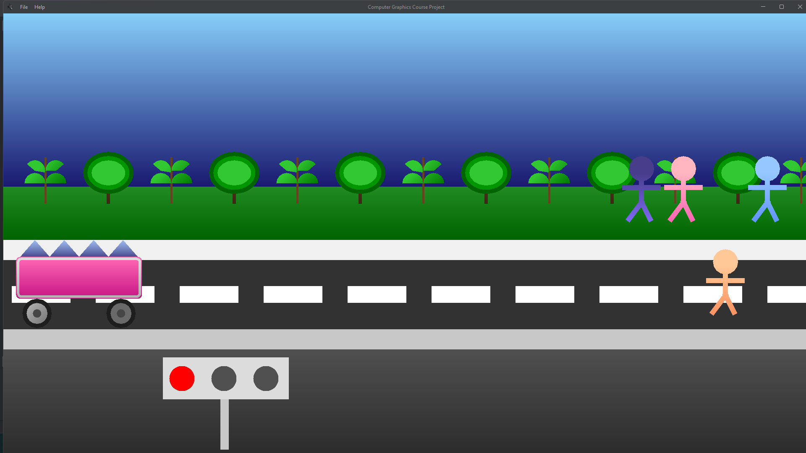

# Computer Graphics Course Project

This is a Java-based desktop application demonstrating a street scene animation using **Java Swing**. The project simulates pedestrians crossing the road, a traffic light system, moving cars, and even a dramatic collision effect—all rendered in a dynamic, animated environment.

---

## 📦 Features

- **Realistic Scene Rendering**:
  - Gradient blue sky, grass, sidewalks, road, and road base.
  - Decorative trees with foliage and trunks.
  - Lane lines and street details.

- **Animated Elements**:
  - Four pedestrians crossing the street, one of which gets "hit" during the animation.
  - Traffic light system that switches between Red, Yellow, and Green.
  - Two animated cars with detailed design including roof, rims, and wheels.

- **Collision Animation**:
  - A pedestrian is hit by a fast-moving car and flies off at an angle with rotation for a dramatic effect.

- **Dark Mode UI**:
  - Uses `FlatLaf` to provide a modern dark-themed look.

- **Menu Bar Options**:
  - File > Minimize: Minimizes the window.
  - File > Exit: Closes the application.
  - Help > About: Displays credits/info.

---

## 🚀 How to Run

### 1. Requirements

- **Java JDK 8 or above**
- **FlatLaf library**  
  [Download FlatLaf JAR](https://www.formdev.com/flatlaf/) and place it in your project classpath.

### 2. Folder Structure

```
project-root/
├── Main.java
├── assets/
│   └── spider.png
```

Ensure the `spider.png` icon is inside the `assets/` folder relative to your working directory.

### 3. Compile and Run

#### Option A: Using Terminal

```bash
javac -cp .:flatlaf-<version>.jar Main.java
java -cp .:flatlaf-<version>.jar Main
```

> **Note for Windows**: Replace `:` with `;` in the classpath.

#### Option B: Using an IDE (e.g., IntelliJ, Eclipse)

1. Create a new Java project.
2. Add the `flatlaf-<version>.jar` to your project libraries.
3. Set `Main` as the main class.
4. Run the program.

---

## 🖼️ Screenshots

<div align="center">



</div>

---

## 📋 Notes

- The animation runs automatically on launch.
- The application opens in fullscreen mode.
- The animation stops when the final person either finishes crossing or gets hit and leaves the screen.
---
## 📄 License

This project is licensed under the **MIT License**.  
For more details, see the [LICENSE](LICENSE) file.

---

## 🎬 Enjoy the Show!

Thanks for checking out the project  🚀

